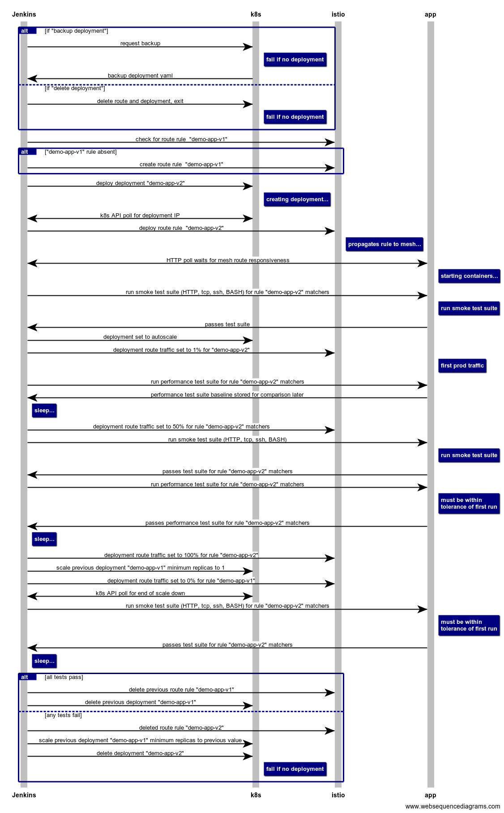

# theseus
Continuous Zero-Downtime Deployments for Kubernetes & Istio

A poor man's Kubernetes-native [Spinnaker](https://www.spinnaker.io/)

Named after [Theseus's paradox](https://en.wikipedia.org/wiki/Ship_of_Theseus):

> does an object that has had all of its components replaced remain fundamentally the same object?

## About

Perform continually-tested and monitored roll-outs to a Kubernetes microservice application.

Testing is a primary design concern:
1. a "dark canary" deployment is made alongside an existing application
1. test traffic is routed to it using `routerules` dynamic request routing
1. if the canary passes its functional and performance tests then `routerule` weight is gradually scaled up, taking load from the previous version
1. if any test metric falls below expected tolerance, the `routerule`'s weight is scaled to zero, with the previous version (that hasn't been scaled down) picking up the traffic
1. *todo:* as traffic is scaled up, functional and performance tests are persistently re-run

Test invocations are currently implemented as script hooks.

This project is currently in *alpha*, feedback and PRs welcome.

# Sequence

Currently missing from diagram:

- performance tests
- traffic scale up



# Developing Theseus

If you wish to work on Theseus, you'll first need [Go](http://www.golang.org) installed on your machine (version 1.9+ is *required*). Alternatively, you can use the provided docker containers provided with appropriate development tooling already set up for you.

For local development of Theseus, first make sure Go is properly installed and that a [GOPATH](http://golang.org/doc/code.html#GOPATH) has been set. You will also need to add `$GOPATH/bin` to your `$PATH`.

Next, using [Git](https://git-scm.com/), clone this repository into `$GOPATH/src/github.com/controlplaneio/theseus`. All the necessary dependencies are either vendored or automatically installed, so you just need to type `make`. This will compile the code and then run the tests. If this exits with exit status 0, then everything is working!

```sh
$ cd "$GOPATH/src/github.com/controlplaneio/theseus"
$ make
```

# TODO

- Rewrite prototype in go
- Configurable polling interval aka disable turbo-mode
- Normalise `precedence` upon deploy to avoid constant increments
- Move to an operator
- Allow webhooks for tests
- Improve journaling, audit and state
- Integrate with prometheus
- Provide YAML deployment flow templates
- Permit run without sidecar bypass
- Move test suite to sockshop (reviews is JVM and flaky)

<!--
https://www.youtube.com/watch?v=05EZx3MBHSY
rolling red/black, validation gates, %ages: 1, 5, 25, 50 100
canary: common measurements, underlying metrics, cpu/mem profiling, latency, error codes
  - acceptable deviations
  - canary sample at 1%, 50%, 100%
  - mitigating measures without losing velocity
-->

## sequence diagram source

---

```
title theseus


alt if "backup deployment"
    Jenkins->k8s: request backup
    note right of k8s: fail if no deployment
    k8s->Jenkins: backup deployment yaml
else if "delete deployment"
    Jenkins->k8s: delete route and deployment, exit
    note right of k8s: fail if no deployment
end

Jenkins->istio: check for route rule  "demo-app-v1"
alt "demo-app-v1" rule absent
    Jenkins->istio: create route rule  "demo-app-v1"
end

Jenkins->k8s: deploy deployment "demo-app-v2"
note right of k8s: creating deployment...
Jenkins<->k8s: k8s API poll for deployment IP
Jenkins->istio: deploy route rule  "demo-app-v2"
note right of istio: propagates rule to mesh...

Jenkins<->app: HTTP poll waits for mesh route responsiveness
note right of app: starting containers...
Jenkins->app: run smoke test suite (HTTP, tcp, ssh, BASH) for rule "demo-app-v2" matchers
note right of app: run smoke test suite
app->Jenkins: passes test suite

Jenkins->k8s: deployment set to autoscale
Jenkins->istio: deployment route traffic set to 1% for "demo-app-v2"
note right of app: first prod traffic
Jenkins->app: run performance test suite for rule "demo-app-v2" matchers
app->Jenkins: performance test suite baseline stored for comparison later
note right of Jenkins: sleep...
Jenkins->istio: deployment route traffic set to 50% for rule "demo-app-v2" matchers
Jenkins->app: run smoke test suite (HTTP, tcp, ssh, BASH)
note right of app: run smoke test suite
app->Jenkins: passes test suite for rule "demo-app-v2" matchers
Jenkins->app: run performance test suite for rule "demo-app-v2" matchers
note right of app: must be within\ntolerance of first run
app->Jenkins: passes performance test suite for rule "demo-app-v2" matchers
note right of Jenkins: sleep...
Jenkins->istio: deployment route traffic set to 100% for rule "demo-app-v2"
Jenkins->k8s: scale previous deployment "demo-app-v1" minimum replicas to 1
Jenkins->istio: deployment route traffic set to 0% for rule "demo-app-v1"
Jenkins<->k8s: k8s API poll for end of scale down

Jenkins->app: run smoke test suite (HTTP, tcp, ssh, BASH) for rule "demo-app-v2" matchers
note right of app: must be within\ntolerance of first run
app->Jenkins: passes test suite for rule "demo-app-v2" matchers
note right of Jenkins: sleep...


alt all tests pass
    Jenkins->istio: delete previous route rule "demo-app-v1"
    Jenkins->k8s: delete previous deployment "demo-app-v1"

else any tests fail
    Jenkins->istio: deleted route rule "demo-app-v2"
    Jenkins->k8s: scale previous deployment "demo-app-v1" minimum replicas to previous value
    Jenkins->k8s: delete deployment "demo-app-v2"
    note right of k8s: fail if no deployment
end
```


